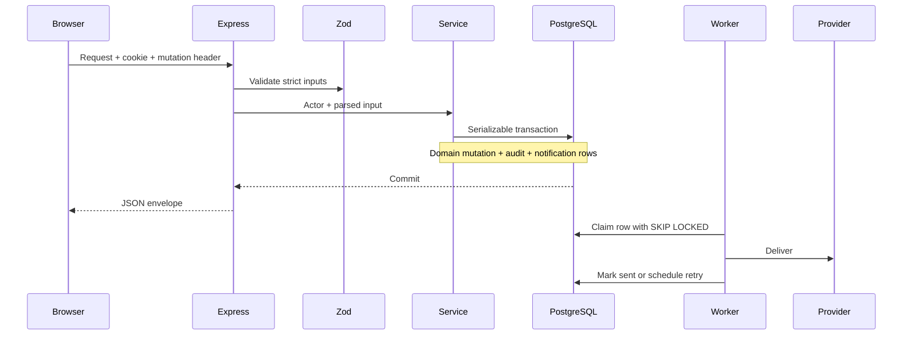

# Implementation decisions

Status: implemented; local validation results in [verification.md](../verification.md).

The supplied plan is the product/architecture reference. The initial files-only delivery was followed by an authorized local installation and verification pass. No branches, commits, external deployment or frontend modifications were performed.

## Architecture

Use a modular Express monolith with strict TypeScript, PostgreSQL 16, Prisma and Zod. `endpoint()` combines repeated validation, controller/envelope wiring and OpenAPI registration. Route handlers delegate domain decisions to services. Query helpers live in repositories; services also make Prisma calls inside transactions so aggregate changes, audit and outbox share one transaction. This is a deliberate simplification of the plan's repository-only Prisma rule; it is not claimed to be a strict implementation of that layering requirement.

Use one complete initial migration because this is a new database delivered in one pass. SQL contains `citext`, all relations/indexes, mandatory consent columns and cancellation/file-size checks. No synthetic historical commits or migrations are fabricated.

## Authentication

Use Argon2id for staff passwords and peppered HMAC-SHA256 for patient codes. Email OTP is the default instead of SMS-first: it proves control of the email used to look up identity, prevents registration with someone else's email followed by authentication through an attacker-supplied phone, and works locally through Mailpit. Authenticated phone start/verify endpoints prove phone control separately; appointment SMS is skipped until verification succeeds. Phone changes invalidate verification and outstanding phone codes. Adding SMS-first login requires a clear email-ownership flow.

Refresh tokens are opaque and stored hashed. Rotation/reuse is transactional; session versions invalidate access tokens after compromise/reset/role changes. Current roles are loaded from the database, avoiding stale privilege claims. Refresh cookie scope is `/api/v1/auth`, slightly broader than the plan's `/auth/refresh`, so logout can revoke it.

All browser mutations require the custom header and allow-listed Origin when present. Clients without Origin still require the header, allowing CLI clients. Rate limits are process-local; identifier OTP quotas and staff lockout are database-backed. Deploy one API replica unless a shared rate-limit store or edge limiter is configured.

## Outbox and storage

Notification fan-out is in the domain transaction. Auth bodies are encrypted with AES-GCM before entering the outbox and scrubbed after delivery/expiry/exhaustion. The encryption key is derived from OTP_PEPPER; rotate only after draining or expiring pending auth messages. Clinical audit records store action/entity identifiers, not copies of medical records.

Worker claims use an atomic PostgreSQL UPDATE with `FOR UPDATE SKIP LOCKED`; a two-minute lease allows recovery after crashes. Claim IDs fence completion updates. Delivery is **at least once**: a crash between provider acceptance and database completion can redeliver. Resend receives an idempotency key; SMTP/Twilio duplicates remain possible. Five attempts use exponential backoff. A late lease is not a promise of exactly-once external delivery.

MinIO/S3 stores private documents. The local provider is development/test only, with signed download capabilities. HTTP uses only generated object keys, never a user-supplied storage path. Failed database creation removes the uploaded object when possible; cleanup failures log the object key for reconciliation.

The plan does not contain a patient timezone field. Notification dates therefore use `NOTIFICATION_TIMEZONE` (default Africa/Lagos); add a patient preference before offering per-patient timezone rendering.

## Delivery and deferred execution

CI and Docker use the generated lockfile and Node 24, matching the installed local LTS runtime. The publishing workflow builds images manually; target-host deployment and approval policy remain operator-controlled because no host is supplied. The frontend client is an example inside this repository; the external frontend is untouched. Local checks and measured coverage are recorded in the verification report. No release tag, external deployment or restore drill is asserted.

Targeted dependency overrides update Prisma's deepmerge-ts to 8 and hyperid's uuid to 11 to resolve audit findings while retaining the current Prisma schema/client architecture. Prisma validation/migration commands and the autocannon smoke test exercise those dependency paths. Reassess the overrides when their parent packages adopt fixed versions.
