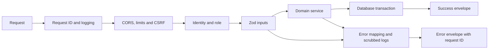
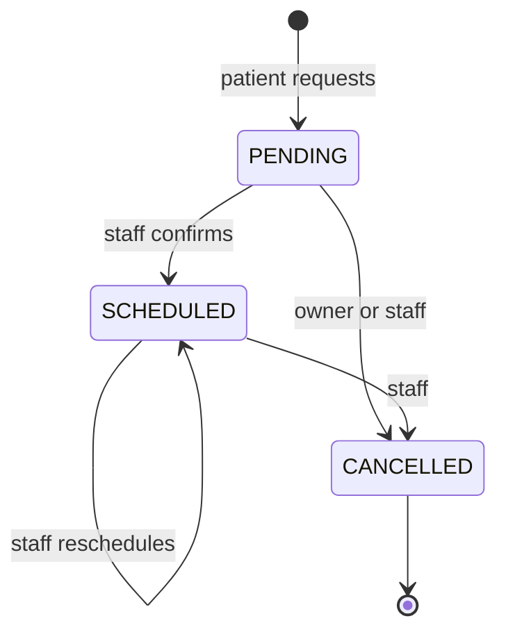

# Implementation map

This implements the reference plan in one project. Local dependencies, services and checks have now been executed; see [verification results](../verification.md). The original branch/PR/release workflow and external deployment have not been executed. The table maps each planned step to its implementation and verification method.

| Step               | Implementation                                                 | Verify later                                 |
| ------------------ | -------------------------------------------------------------- | -------------------------------------------- |
| 01 Foundation      | Strict TS, env, logging, errors, request ID, health, shutdown  | Unit HTTP/config tests, build, SIGTERM       |
| 02 Database        | Full initial migration, Docker Postgres, seed and DB utilities | Fresh deploy, idempotent seed, restore drill |
| 03 Doctors         | Lookup and admin management                                    | Swagger after seeding                        |
| 04 Validation/docs | Shared endpoint validation and OpenAPI registry                | `docs:api`, HTTP schema tests                |
| 05 Docker/CI       | Dockerfile, dev Compose and CI                                 | Install/commit lockfile, then build and CI   |
| 06 Staff auth      | Argon2id, JWT, rotation/replay, lockout                        | Auth tests and cookie checks                 |
| 07 Outbox          | Transactional fan-out, leases and retry worker                 | Rollback/deduplication/concurrent claims     |
| 08 Patient OTP     | Email OTP, attempt/expiry/quota limits                         | HTTP journey and Mailpit                     |
| 09 Users/audit     | Profile, invitations, roles, audit                             | Admin/role tests                             |
| 10 Files           | Multipart, signatures, private S3/local storage                | File tests and MinIO                         |
| 11 Patients        | Consents, ownership and staff audit                            | Registration/ownership tests                 |
| 12 Appointments    | State machine, filters, stats, schedule/cancel                 | Unit state tests and journey                 |
| 13 Email           | Shared React Email layout, SMTP/Resend/test adapters           | Mailpit/provider tests                       |
| 14 Account flows   | Reset, invite completion and verify-email                      | Token expiry/single-use tests                |
| 15 Inbox           | Inbox, read/read-all, preferences                              | Notification integration tests               |
| 16 Observability   | Pino redaction, Sentry scrubbing, heartbeat                    | Logging tests, staging fault injection       |
| 17 Security        | CSRF, helmet, quotas, lockout, config checker                  | Security tests and dependency audit          |
| 18 E2E/quality     | Isolated-DB HTTP journey, coverage and load scripts            | Execute checks; establish release gates      |
| 19 Frontend        | Copyable browser client and integration guide                  | Future frontend-repository cutover           |
| 20 Release         | Production Compose, publishing, backups/runbooks               | Future host setup, staging and restore drill |

Transactions use serializable isolation with limited serialization-conflict retries. Failed OTP/login attempts commit counters before returning an error. Local test/smoke results are in the verification report; production capacity and deployment have not been validated.
